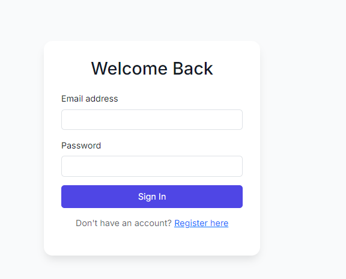
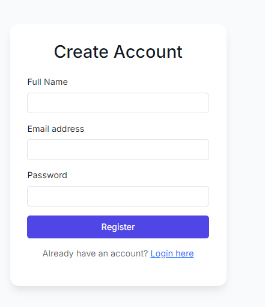
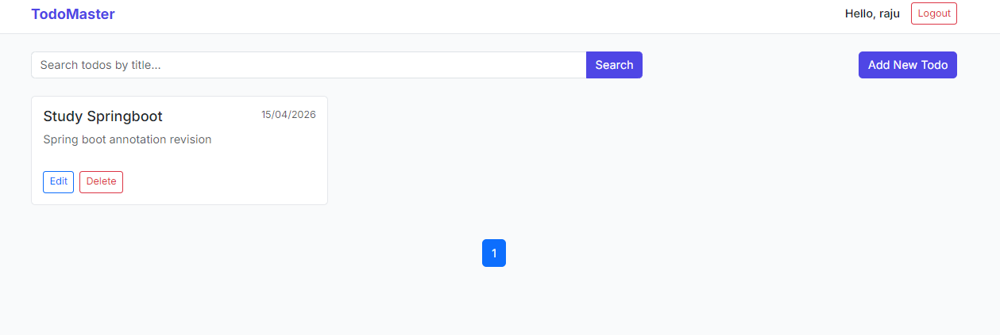
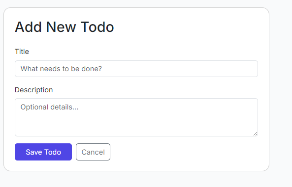
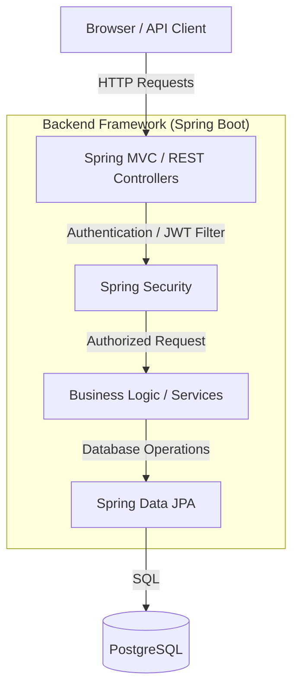
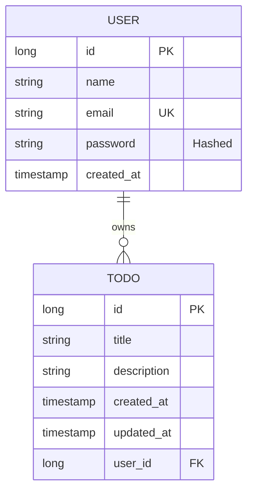
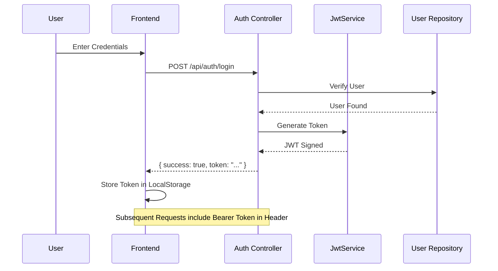

# 🚀 Premium Todo List Application | Spring Boot + JWT + Thymeleaf

[](https://www.oracle.com/java/)
[](https://spring.io/projects/spring-boot)
[](https://jwt.io/)
[](https://www.postgresql.org/)
[](http://localhost:8080/swagger-ui/index.html)
[](LICENSE)

A production-ready, full-stack **Spring Boot** application designed with **Clean Architecture**. This project showcases a secure, high-performance hybrid system using **Thymeleaf** for the frontend and a stateless **JWT-based REST API** for data management.

---

## 📸 Screenshots

<details>
<summary><b>View Application Gallery</b></summary>

### 🔐 Multi-Auth System

*Modern Login Interface*


*Seamless User Onboarding*

### 📋 Task Management

*Glassmorphism Dashboard with real-time search*


*Simple & Intuitive Task Creation*

</details>

---

## 🏗️ System Architecture

### High-Level Architecture


### Database Schema (ER Diagram)


---

## 🔐 Authentication Workflow



---

## 🌟 Key Features

- **🔐 Enterprise Security**: Stateless JWT authentication with standard Bearer token support.
- **📚 Interactive API Docs**: Integrated **Swagger/OpenAPI** for real-time API testing.
- **🏗️ Decoupled Design**: Pure separation of concerns using the Service-Repository pattern.
- **🔍 Smart Searching**: Advanced backend keyword filtering and pagination powered by Spring Data.
- **🎨 Glassmorphism UI**: modern design system with Bootstrap 5 and customized CSS.

---

## 🛠️ Technology Stack

| Category | Technology |
| :--- | :--- |
| **Backend** | Java 17, Spring Boot 3.2, Spring Security |
| **Authentication** | JSON Web Token (JWT), BCrypt |
| **Database** | PostgreSQL, Hibernate, Spring Data JPA |
| **Frontend** | Thymeleaf, JavaScript, Bootstrap 5 |
| **Documentation** | SpringDoc OpenAPI (Swagger UI) |
| **Build Tool** | Maven 3.x |

---

## 🚀 Getting Started

### 1. Prerequisites
- **PostgreSQL** (Database name: `todo_db`)
- **Maven** and **JDK 17+**

### 2. Configuration
Update `src/main/resources/application.properties` with your PostgreSQL username and password.

### 3. Execution
```bash
mvn clean install
mvn spring-boot:run
```

---

## 🐳 Containerization (Docker)

Run the entire stack (App + Database) with a single command:

```bash
docker-compose up --build
```

The application will be available at `http://localhost:8080`.

---

## 📖 API Documentation (Swagger)

Once the application is running, you can access the interactive API documentation and test all endpoints:

📍 **Swagger UI**: [http://localhost:8080/swagger-ui/index.html](http://localhost:8080/swagger-ui/index.html)  
📍 **OpenAPI JSON**: [http://localhost:8080/v3/api-docs](http://localhost:8080/v3/api-docs)

> **Pro Tip**: Use the "Authorize" button in Swagger and paste your JWT token (after logging in via `/api/auth/login`) to test protected Todo endpoints!

---

## 📁 Project Overview

- `controller/`: Entry points for REST and UI navigation.
- `service/`: Core business logic and security checks.
- `repository/`: Data persistence interfaces.
- `entity/`: Database models.
- `security/`: JWT handling and path security config.
- `config/`: Application and OpenAPI beans.

---

## 📜 License
Licensed under the [MIT License](LICENSE).
